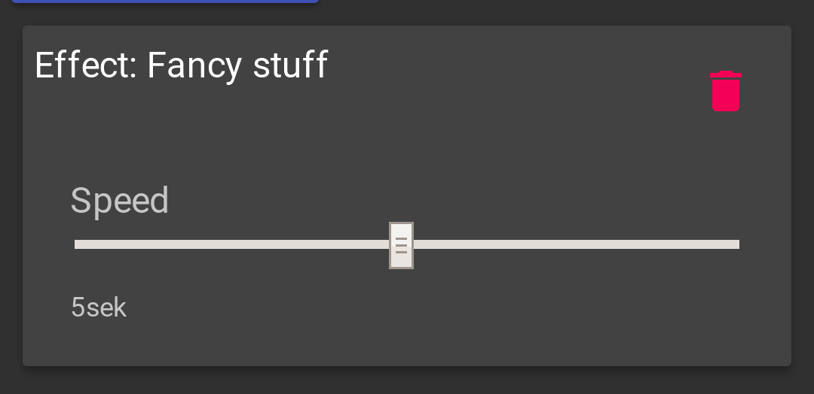

# Create a new Effect

The creation of a new Effect consists of three parts:
1. Implementing the effect in the firmware
2. Integrating the effect in the `EffectStack`
3. Enable the effect in the user interface.

The following documentation will give you help, how to achieve this.
Please also note the documentation about the [build process](dev_build_process).

## Implementing the effect in the firmware

Effects are C++ classes that sit in `lib/Effecs`.
By convention all effects are prefixed with *E*.
So the *dot-effect* becomes `EDot`.

Effects are derived from the `Effect` class from `/lib/Effects/Effect.h` and need to implement its virtual methods: `update()`, `restart()`, `config()`.
The method `config()` is called when a new configuration was read.
It gets the configuration for the effect passed.
Put all your configuration in thi method.
Configuration options are read with the `getOption(const String& option, const T& default_value)` method.
To read an option `speed` as `int` you do the following:
```cpp
void EDot::config(const ConfigWrapper &cfg) {
  ...
  speed = cfg.getOption(F("speed"), 10);
  ...
}
```
This reads an option `"speed"` and sets a default of `10` if the option is not present.
The `F()` around the option makes sure, that the string ends up in the flash memory and does not waste RAM.

At the end of `config()` call `restart()` if necessary.
The `restart()` method should contain all effect-initialization.
If your effect needs to know the start time for example, the put the initialization here:
```cpp
void ERainbow::restart() {
  ...
  start_time = millis();
  ...
}
```

To actually draw your effect `update()` is called for every frame.
This method gets the current `LEDband` and the frame time.
The time sould be used to determine the progress of your effect.
Please do not depend on any previous state of the actual band, as the LED-Set gets cleared at the start of each frame.

The `LEDBand` had three sets of LEDs:
* `allLeds()` provides a set that contain all LEDs of a channel.
* `upperLeds()` provides the upper half of the channel.
* `lowerLeds()` provides the lower half of the channel.

To make the third LED of the upper half green, just do:
```cpp
  ...
  band.upperLeds()[2] += CRGB::Green;
  ...
```

Please note, that we do always add collors and never assign.
This is important to enable the stacking of multiple effects: The result is always the sum of all effects.

You should also provide a coefficient that the user can change in the configuration to change the visibility (strength) of the effect.
For example, if you have `coeff` as coefficient in the config, just multiply the color value with it before adding:
```cpp
  // coeff was set e.g. to 0.5
  ...
  band.upperLeds()[2] += CRGB::Green * coeff;
  ...
```
This only works with CRGB values.
If you operate with CHSV values, just multiply the val component with `coeff`:
```cpp
  // coeff was set e.g. to 0.5
  ...
  CHSV myColor(hue, 255, uint8_t(255.0f * coeff));
  ...
  band.upperLeds()[2] += myColor;
  ...
```

You can look at the `ERainbow` effect as an easy example:
* Header: [ERainbow.h](https://github.com/Retardigrades/blinkenhat/blob/master/lib/Effects/ERainbow.h)
* Implementation: [ERainbow.cpp](https://github.com/Retardigrades/blinkenhat/blob/master/lib/Effects/ERainbow.cpp)


## Integrating the effect in the EffectStack

In the `EffectStack` in `lib/Effects/EffectStack.cpp` is the method `EffectStack::createEffect()` defined.
This maps effect names from the configuration to actual effects.
You need to integrate your effect here.

For example, if you created a fancy effect in `EFancy` with the name `fancy` in the configuration, you need to add:
```cpp
Effect *EffectStack::createEffect(const HatConfig::EffectCfg &cfg) {
  ...
  if (cfg.type() == F("fancy")) {
    Effect *fx = new EFancy();
    fx->config(cfg.config());
    return fx;
  }
  ...
  return nullptr;
}
```

This is all thats needed to create an effect from the configuration.


## Enable the effect in the user interface

The user interface is a single-page web-application written with [React](https://reactjs.org/) and [material-ui](https://material-ui-next.com/).
You don't need to know much details, as all effect definition including how to configure it from a single javascript object.
the object is defined in `web/src/js/EffectDefinition.jsx`.
You can see the current state at [GitHub](https://github.com/Retardigrades/blinkenhat/blob/master/web/src/js/EffectDefinition.jsx#L46).

Just put your effect definition here.
Take one of the existing effects as an example.
If your *fancy-effect* has only the `speed` option from above, then you would add:
```javascript
export const effects = {
  ...
  fancy: {
    name: "Fancy stuff",
    cfg: {
      speed: speedSlider("Speed", 200, 10000, 200, 5000),
    }
  },
  ...
};
```

To compile the web-code yourself you need nodejs installed.
The easiest way is to use [nodeenv](https://pypi.python.org/pypi/nodeenv) to get a local installation.
Any other nodejs installation should work if it is recent enough.

We assume for all further commands, that you're in the `web` subdir of the project.
If you have your node installation, you can install all the dependencies for the ui with the `npm` command:
```bash
$ npm install
```

After this, you can compile the frontend using:
```bash
$ NODE_ENV="production" npm run build
```

This generates the compiled `index.html` in `web/dist`.
The platformio build process will compress this file and converts it to a C-header (`lib/WebServer/index.h`) that get included in the firmware build.

The result should look like this when you tap the add menu:


And like this when its added:

