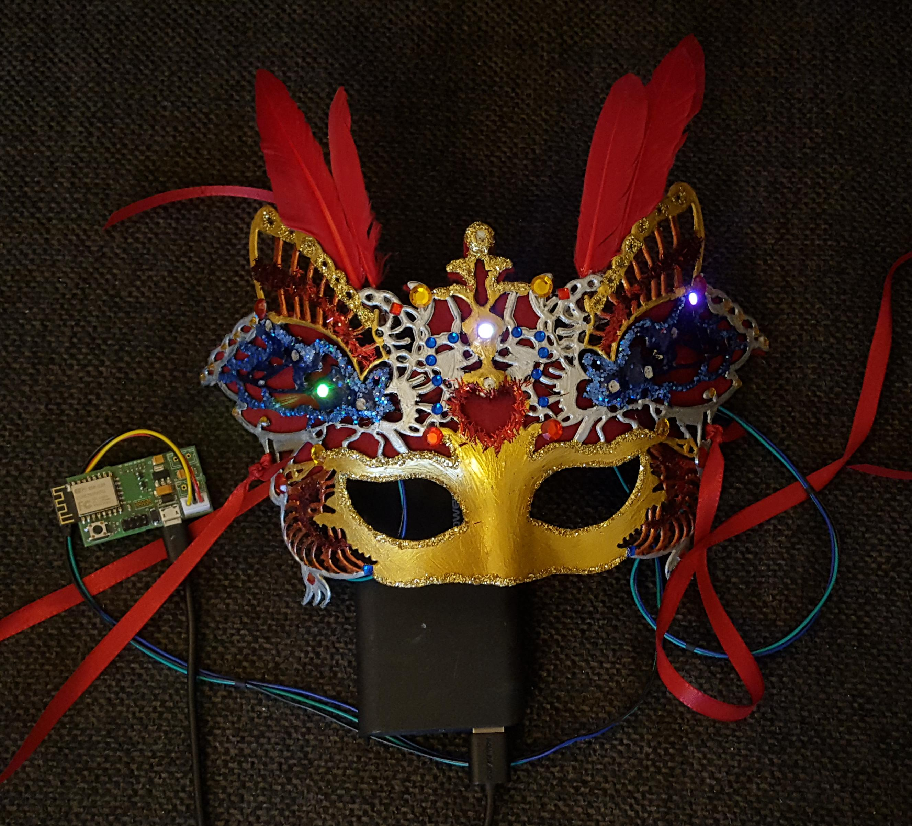

# Usage of the LED channels

The BlinkenHat has two *Channels* for LEDs.
These are the two white connectors marked with *J1* and *J2*.
You can find the o the lower-right corner of the board.

Each channel can control up to 100 LEDs in the standard software
(You can increase this to a higher number if you edit a [definition in the software](https://github.com/Retardigrades/blinkenhat/blob/master/lib/LEDBand/LEDBand.h#L7) and [build it](dev_build_system)).
To set the number of connected LEDs, use the [user interface](usage_user_interface).

You can connect any shape/setup/project that uses a *WS2812b* type of LEDs.
This can be your hat, a blinking tie or something more fancy like a mask:

The only thing you need to take care of is, that you connect the wires in the right order.
If you're looking at the connector, that you can read the print on the board in the right orientation (the microcontroller in the upper left), then the wiring is:

| Vcc | Data | GND |

Just connect your LEDs, set the number of LEDs in the [user interface](usage_user_interface) and configure your effects.
