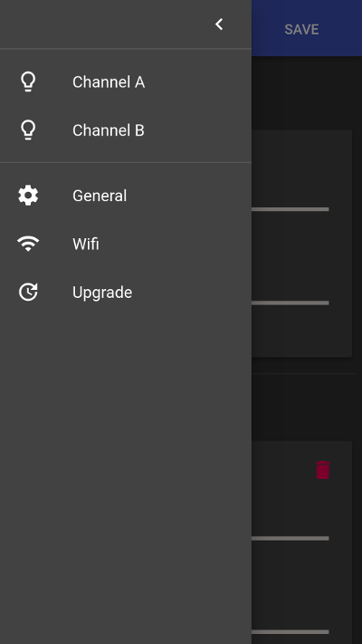
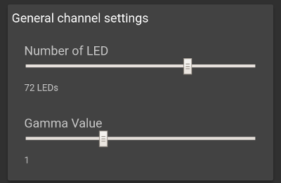
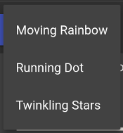
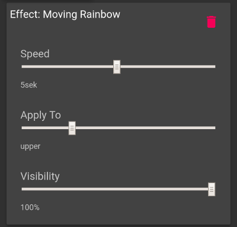
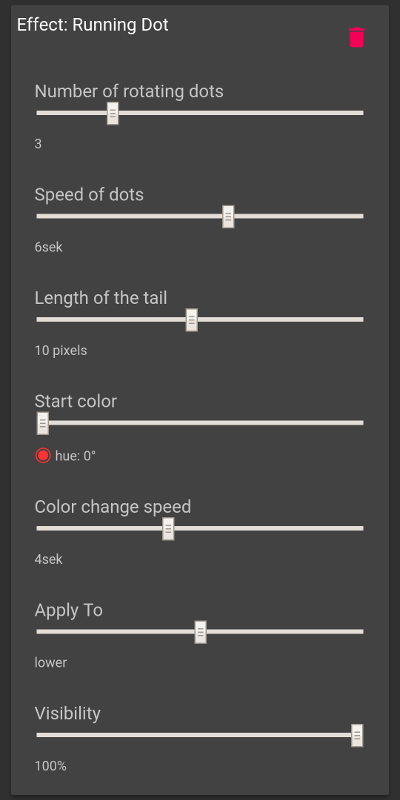
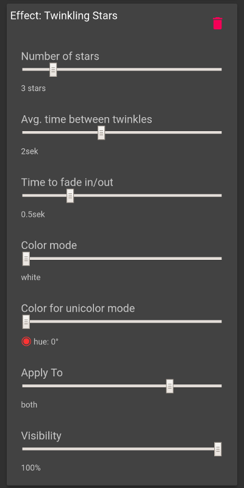

# User Interface

The BlinkenHat can be configured through a user interface.
The interface is implrmented as a web application that can be retrieved via any webrowser.
This has the benefit that you don't need an app.
The web application is included in the firmware of the controller - so you don't need internet access to use it.

## Connecting

To connect to the website you first need to connect to the controllers WiFi.
After you started the controller (plugged it in a USB power source or pressed the reset button) it is ready to connext.
On your Smartphone/Tablet/Laptop search for a WiFi that starts with *blinkenhat* and some random letters afterwards.
The parts after *blinkenhat* is the ID of your device and is used to give the WiFi a unique name.
Please connect to this WiFi using the default password *blink_password*.

After the connection process open your browser and type in a random http address like *blink.com*.
Almost any address should work except https-only ones like google or facebook.
You can also just use random letters and bookmark this.

Now you see the default view of the user interface:

## Menu

The menu contains five entries:
* *Channel A* and *Channel B* allow you to configure the two LED channels including the number of LEDs and the applied effects.
* *General* contains general settings of the device like the global brightness.
* *Wifi* contains the wifi settings.
* *Update* allow you to update the device with a new firmware version.

## Channel configuration

A channel represents one of the two LED connectors of the device.

### General Settings

These settings are general for the channel and independend of any effect.

* **Number of LEDs:**
  This setting tells teh controller, how many LEDs are connected to the channel.
  Set this to the number of LEDs that are connected to the channel.
  Most effects can divide a channel in two equal parts and be applied to either only one part or both.
  The reason for this is taht the original plan was to have two rows of LEDs around the Hat.
* **Gamma Value:**
  This changes the value that is used in a [Gamma correction](https://en.wikipedia.org/wiki/Gamma_correction) of the channel.
  You can play around with the value to get different effects.

### Effects

You can add any amount of Effects to a channel.
Effects are added together to produce the final result.
So if you select a rainbow and stars for a channel, then you will get rainbow-colored LEDs and stars on top.
It is possible to add the same effect with different settings multiple times.

To add an effect, just press the *add effect* button: 

Then select the effect to add in the menu: 

The effect appears below at the end of the effect list.

Each Effect has a remove button: 

A click on it will remove the effect from the channel.
It can be added again at any time.

#### Effect: Rainbow

This effect tints the LEDs with the colors of a rainbow.
The rainvow then cycles through the strip.

* **Speed:**
  This value defines the time in seconds the rainbow needs for one cycle.
  You can set this to zero if you don't want any cycling.
* **ApplyTo:**
  This defines to which part of the strip of LEDs the effect gets applied.
  The possible values are:
  * Do not apply at all - The effect has no effect at all.
  * Apply to upper - only the upper half gets the effect.
  * Apply to lower - only the lower half gets the effect.
  * Apply to both - Applies the effect to one half and copies it to the other part.
  * Apply to all Leds as one long strip - Uses all LEDs as one strip and do no separation or copying at all.
* **Visibility:**
  This defines how much the effect shall be visible on the LED strip.

#### Effect: Running Dot

This effects draws moving dots on the strip that pull a tail behind them.
The dots can change their colors as they move.

* **Number of rotating dots:**
  This tells how many dot shall be drawn. The dots are euallly distributed over the strip.
* **Speed of dots:**
  This is the time in seconds a single dot needs for one turnaround.
* **Length of tail:**
  The length of the tail a sibgle dot pulls behind itself.
* **Start color:**
  This is the color the dit starts with at the beginning of the effect.
* **Color change speed:**
  The time in seconds t needs to make a full cycle on the colorspace.
  If you set this value to zero the color will not change at all.
  Together with the start color you can set a single solid color the dots have all the time without changing.
* **ApplyTo:**
  This defines to which part of the strip of LEDs the effect gets applied.
  The possible values are:
  * Do not apply at all - The effect has no effect at all.
  * Apply to upper - only the upper half gets the effect.
  * Apply to lower - only the lower half gets the effect.
  * Apply to both - Applies the effect to one half and copies it to the other part.
  * Apply to all Leds as one long strip - Uses all LEDs as one strip and do no separation or copying at all.
* **Visibility:**
  This defines how much the effect shall be visible on the LED strip.

#### Effect: Twingling Stars

This flashes a defined amount of stars on teh strip at random positions.
The stars can be white, a defined color or a random color on every flash.

* **Number of stars:**
  How many stars shall be shown.
  Each star gets calculated separately so they won't show up at the same time but they use the same settings.
* **Avg. time between twinkles:**
  This is the time a single star stays dark before it shows up again.
  It is an average as the value gets a random offset of plus/minus 30% to make the effect more random.
* **Time to fade in/out:**
  This defines the time a star needs from being dark to its full brightness and also how long it needs to get dark again.
  The brightnes function of a star is:
  y = -1.0 * ( x / fade)2 + 1.0
  Where y is the brightness from 0.0 to 1.0 and x is the time from `-fade` to `fade`.
* **Color mode:**
  This defines how the color should behave the stars appear with.
  There are three modes available:
  * White only - All stars are white.
  * Unicolor - All stars have one inchanging color.
  * Dynamic color - every star has a different random color each time it appears.
* **Color for unicolor mode**
  This definies which color should be used in unicolor mode.
* **ApplyTo:**
  This defines to which part of the strip of LEDs the effect gets applied.
  The possible values are:
  * Do not apply at all - The effect has no effect at all.
  * Apply to upper - only the upper half gets the effect.
  * Apply to lower - only the lower half gets the effect.
  * Apply to both - Applies the effect to one half and copies it to the other part.
  * Apply to all Leds as one long strip - Uses all LEDs as one strip and do no separation or copying at all.
* **Visibility:**
  This defines how much the effect shall be visible on the LED strip.
